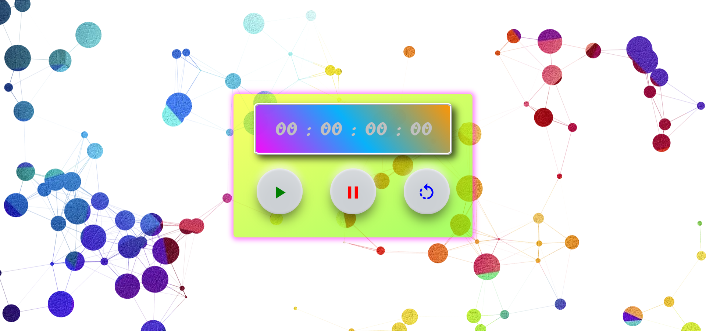

# 👨‍💻 Expense Tracker App (Progressive Web App).
## 📽 A project based on Panacloud React Bootcamp [Project 7B].

### ⚒ Project Demo:
####  For Project Demo Follow the Link: http://timer-tdd-react.surge.sh/

### 🕵️‍♂️ Project Details:
####  This project is based on primarily on React TypeScript as well as uses other libraries too and it follows Test-Driven-Development. In this app, you can use stopwatch with offline availability!

### ⚙ Technical Details:
#### In this project, React with TypeScript is used for the project. Other Libraries used includes Material-UI, Jest, Enzyme and React-Ts-Particles

### 🤹‍♂️ Skill:
    
    
    
    
    

### ✔ Contributers:

  <a href="https://github.com/faraasat">
    &nbsp&nbsp&nbsp&nbsp&nbsp&nbsp&nbsp&nbsp&nbsp&nbsp&nbsp&nbsp
  </a>

### 📷 Project UI:

  <a href="http://timer-tdd-react.surge.sh/">
    &nbsp&nbsp&nbsp&nbsp&nbsp&nbsp&nbsp&nbsp&nbsp&nbsp&nbsp&nbsp
  </a>

